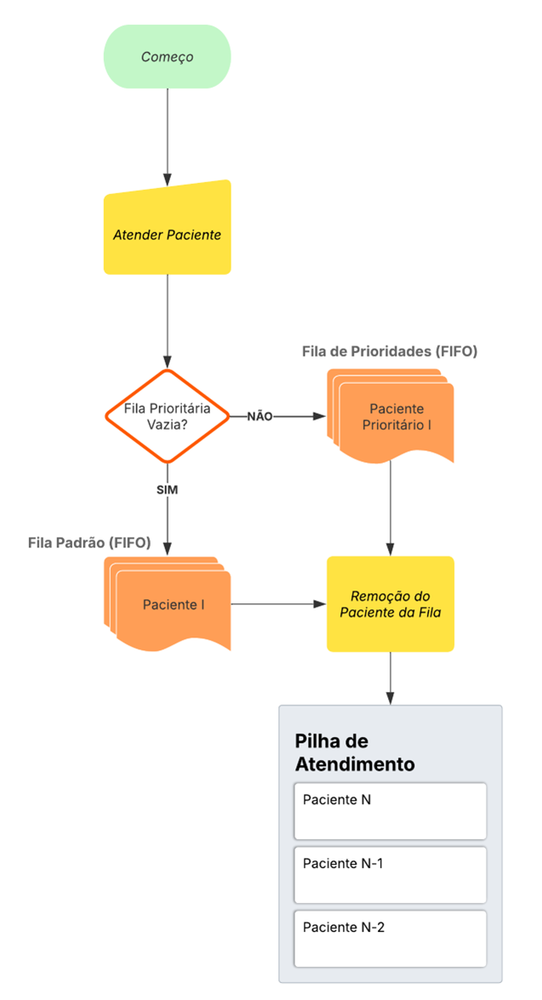

## Fluxo do programa

    O fluxograma acima mostra parte do processo de atendimento de um paciente no programa. Pode-se ver que para atender o próximo paciente, o sistema primeiro verifica se a fila prioritária está vazia. Caso esteja, o paciente da Fila Padrão é atendido, caso contrário, o paciente prioritário é atendido. Com isso, o escolhido é removido da fila e adicionado à Pilha de Atendimento. 
	
    OBSERVAÇÃO: Esse é o fluxo padrão do núcleo do programa, é claro que para melhor gerenciamento, há opções de remoção, busca e limpeza de estruturas.

## 